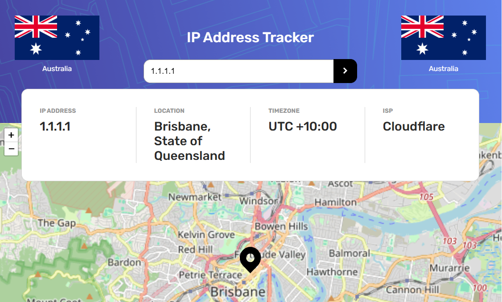

# Web Address Tracker

This project uses React, TypeScript and Tailwind to build a functional, real-world application. It allows the user to search for any IPv4 address or domain name to find out location and ISP for the web server and then display the location on an interactive map. This uses the the IP Geolocation API from IPify and mapping from LeafletJS. The system also uses the country API from the RESTCountries API to display the location's country flag and name.

## Table of contents

- [Overview](#overview)
  - [The challenge](#the-challenge)
  - [Screenshot](#screenshot)
- [My process](#my-process)
  - [Built with](#built-with)
  - [What I learned](#what-i-learned)
- [Author](#author)
- [Acknowledgments](#acknowledgments)

## Overview

### The challenge

Users should be able to:

- View the optimal layout for each page depending on their device's screen size
- See hover states for all interactive elements on the page
- See their own IP address on the map on the initial page load
- Search for any IP addresses or domains and see the key information, location, and country flag.
- See error messages clearly when searches don't yield results

### Screenshot

### Links

- Live Site URL: (https://fiel.us/ip-flag-tracker/)

## My process

### Built with

- React API fetching, asynchronous operations, event handling, data manipulation, and DOM updates.
- Tailwind CSS custom properties
- Vite / TSC transpiling and bundling
- Semantic HTML5 markup
- Mobile-first, responsive, accessible layout

### What I learned

The layout was a bit difficult, especially since the Leaflet map changes its z-index when loaded. This negatively affected the page styling, so we needed to manually set the z-index on other elements in order to bring them to the front.

The other API calls were pretty straightforward. However, many domains did not have ISP's listed, so we had to remove the validation check for them, so that they would be displayed without that data.

## Author

David Fiel

- Website - [David Fiel](https://fiel.us)

## Acknowledgments

- Thanks to Per Scholas!
- Thanks to Danail Gabenski for the IPv4 regex (https://stackoverflow.com/questions/5284147/validating-ipv4-addresses-with-regexp/68104187#68104187)
